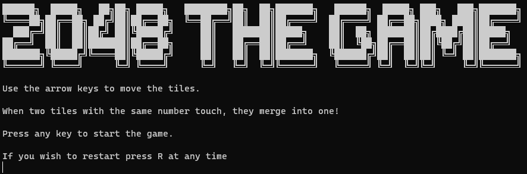

# C# 2048 Game
> My first game in C#. It lacks a lot of functionality but I tried to do the best I could.

## Table of Contents
* [General Info](#general-information)
* [Screenshots](#screenshots)
* [Setup](#setup)
* [Project Status](#project-status)
* [Contact](#contact)

## General Information
- In 2 days without coding before in C# I managed to make the base of the game 2048

## Screenshots

## Setup
To launch the game in your console, simply run the command : 

`$ dotnet run`

## Project Status
Project is: _in progress_ 

## Contact
Created by [@Lucas_Barray] - feel free to contact me!